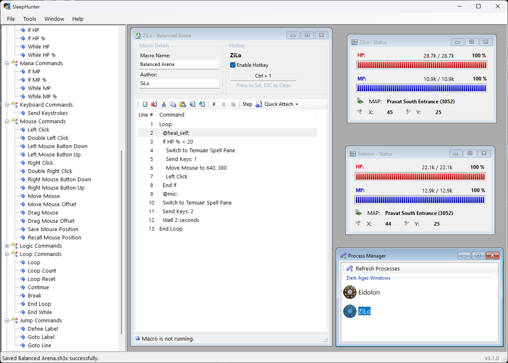

# SleepHunter v3

Dark Ages Automation Tool

This is the third version of SleepHunter, the predecessor to [SleepHunter 4](https://github.com/ewrogers/SleepHunter4).

---

## Requirements

- Dark Ages 7.41
- .NET Framework 4.8 - [Download](https://dotnet.microsoft.com/en-us/download/dotnet-framework/net48)

## Revived Edition 2025

The code was lost in time, but fortunately it was compiled with Debug information and able to be exported via
[dotPeek](https://www.jetbrains.com/decompiler/) while retaining most, if not all, of the code itself. Not that it mattered, because the code
was very bad despite it being functional. Lots of bad practices, tightly-coupled macro and UI code, and **Hungarian Notation**.

What was supposed to be a simple update to make it compatible with the latest Dark Ages 7.41 client turned into a complete rewrite.
The only thing that was kept was the familiar UI and workflow, but the backend macro code was completely rewritten.
This allowed the expansion of many new macro commands, and the framework to add others in the future.

It is also using the .NET Framework 4.8 (instead of 3.5), which is the latest version of the .NET Framework that supports WinForms.

In attempts to make it as seamless of a transition as possible, both the original SleepHunter v3 macro files (`.sh3`)
and the new SleepHunter v3 extended macro files (`.sh3x`) can be loaded. Saving an older macro format will result in the
newer format being saved. Considering the old version no longer works, this should not be an issue.

## Why Bother?

Despite SleepHunter v4 being popular and widely used, I would often get asked about the status of SleepHunter v3.
For non-Dojo tasks and other repetitive tasks, it still filled a need for a lot of people. I would often tell them
that I did not keep the original source code, so it would not be easy for me to update it.

I got curious of how much I would be able to recover with a tool like [dotPeek](https://www.jetbrains.com/decompiler/),
and decided to give it a shot. To my surprise, it was actually quite easy to recover most of the code and get it
in a developable state. More importantly, it kept the original UI and workflow, which was a big plus.

Once I had that, I decided to make it open source and also have it here for archival purposes.
Since the entire app has been rewritten, I feel good about sharing it with the community and hope that it can
be of use to others.

## Which Should I Use?

The best analogy I can make is between driving an automatic transmission car and a manual transmission car.
If you just need to macro your skills and spells in the Dojo, then SleepHunter v4 is probably the best choice.
It will get you from point A to point B with minimal effort and is very easy to use.
It was designed to be such. Set it and forget it.

If you need to automate more than just spells and skills, then SleepHunter v3 is probably the best choice.
From combos to ascending, quick hotkeys, and more. It can be more powerful, but it is more difficult to use by comparison.
I have tried to improve the UI and workflow to make it easier to use, but it is still never going to be "one-click" like
SleepHunter v4.

The good part is you can save and share your scripts with others!

## Development

If you want to build the project yourself, you will need to install the latest Visual Studio.
Unfortunately, due to the WinForms Designer and other legacy things, it is not advised to use other IDEs.